# Kids Fun Zone
Kids Fun Zone is a website that  provides extensive information about indoor playground and its facilities. Users can explore a variety of activities inside the center.
The goal is to create high-quality website, which is functional and visually appealing.
View the live link [here](https://neelp20.github.io/Kids-Fun-Zone/) 

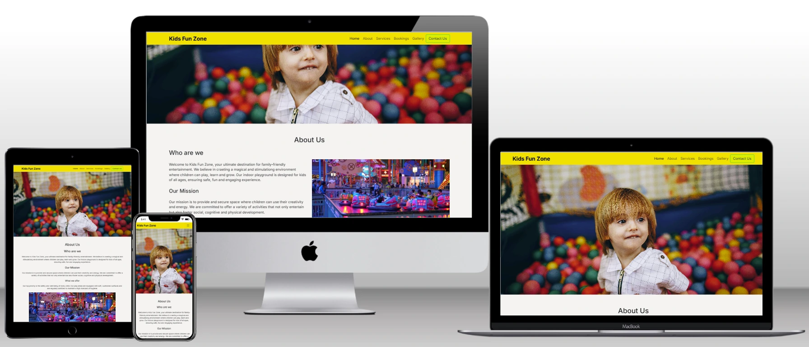

## Overview

### Site wide

* Navigation Menu
  * Contains links to the Home, About, Services, Bookings, Gallery, Contact and is designed to be responsive on all devices.
  * This enables users to easily navigate through the pages on all size of devices.

* Footer
  * It has three parts:-
  * The first part of footer contains the Contact number with email address, which will allow users to contact directly.
  * The second part provides the opening hours and address, which will help users to plan their visit based on distance.
  * The third section includes icons linking to social media websites opening in new tabs. These icons will be accessible to the visually impaired users who may be using a screen reader through the use of aria labels.
  * This will allow users to stay connected across multiple platforms.

* Favicon
  * A Fevicon will be used as a browser icon for a website, which will help users to identify the website and navigate.

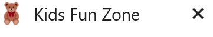

* 404 Page
    * A 404 page will be implemented to display whenever a user encounters a broken link.
    * The 404 page will allow the user to navigate back to the website, without needing to use the browser's back button.

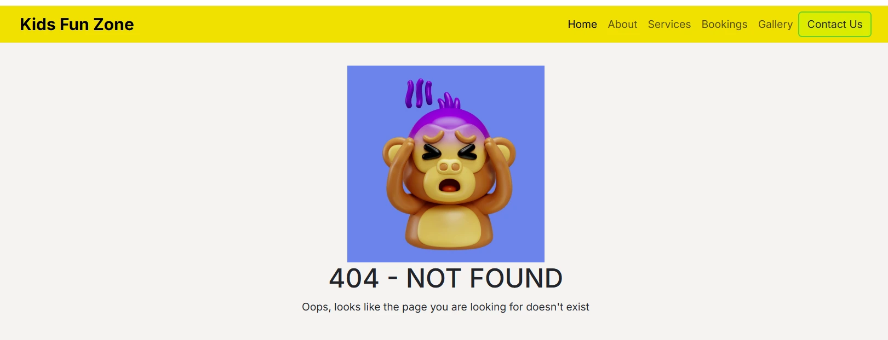

### Landing page
  * Image
    * This will include eye-catching image that provides glimps of the website.

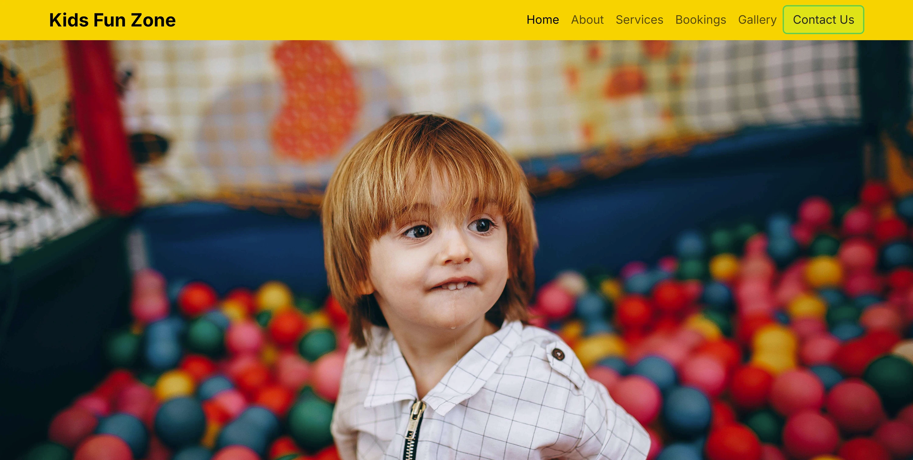

* Website information
  * Information about 'Kids Fun Zone' and the purpose along with a video showcasing one of the indoor play areas.
  * Users will have the option to play and pause the video, minimizing distractions while they read the text.

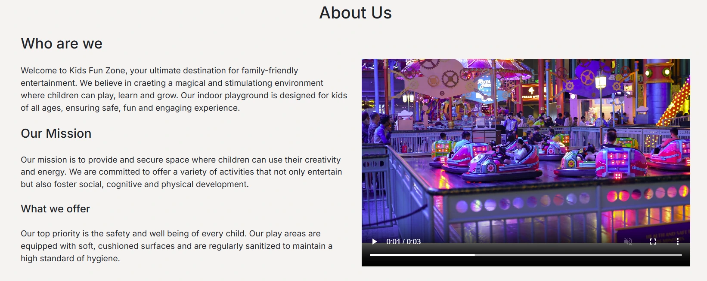

* Services section
  * Services section will feature cards detailing the various types of tickets available at Kids Fun Zone.

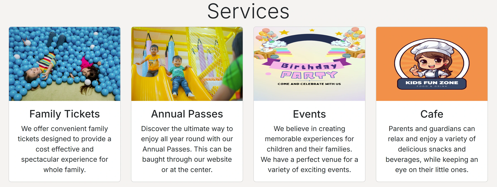

* Booking form
  * A booking form will be implemented to allow users to book the tickets online. The form will consist of the following fields and attributes:
  * First Name (type=text, required )
  * Last Name (type=text, required)
  * Email (type=email, required)
  * Date (type=date, required)
  * Number of kids (type=number, required)
  * Number of adults (type=number, required)
  * Message (textarea, required)
  * Datalist (option to choose from,required)
  * Upon successfully submitting the booking form, the user will be redirected to booking-success.html, where a success message will be displayed.

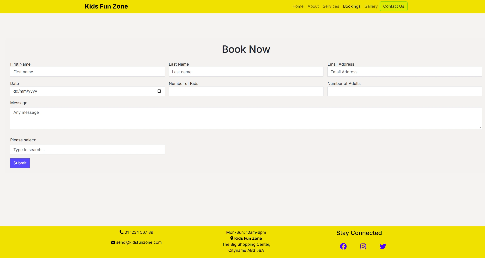

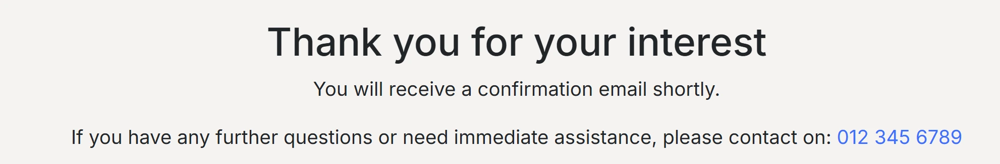

### Gallery Page
  * The gallery will showcase a selection of photos featuring indoor activities, events and the cafe.
  * It will be created using a carousel and will be fully responsive on all devices.

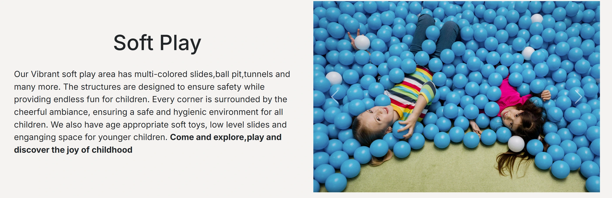

### Features left to implement
  * Testimonials
  * The user should receive the confirmation email in their inbox, after successfully filling out the form.
  * A map should be included to display the distance from Kids Fun Zone to the User's location. 

## Design

### Wireframes

Home page
  

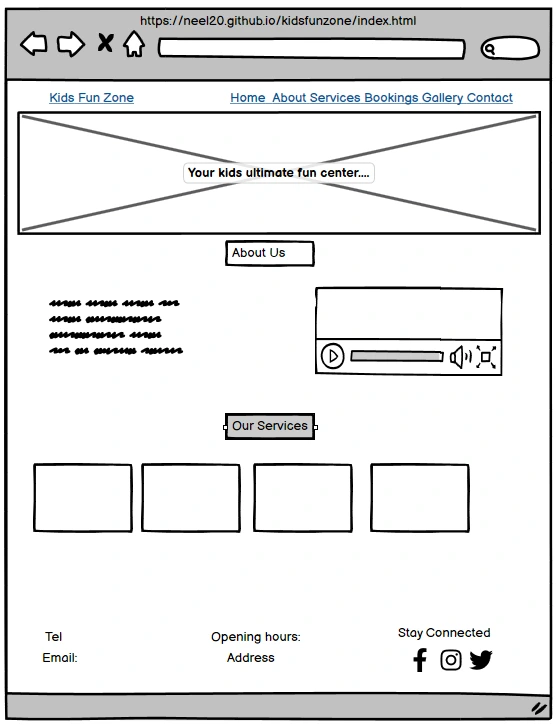

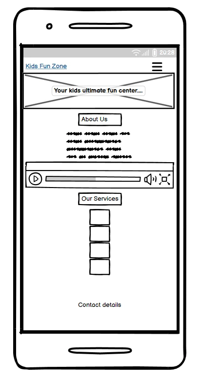
  
Booking Form
  

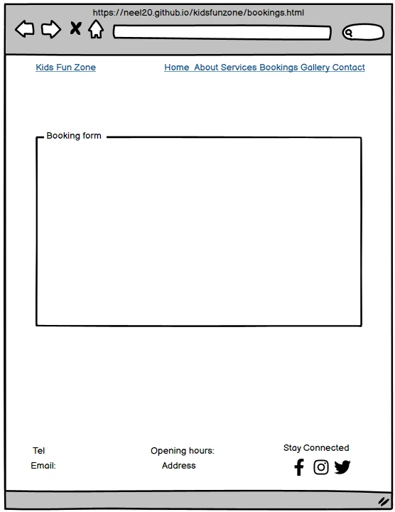

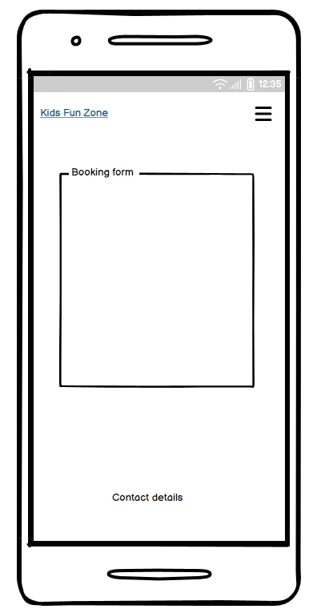
  
Booking Form Success Page
  

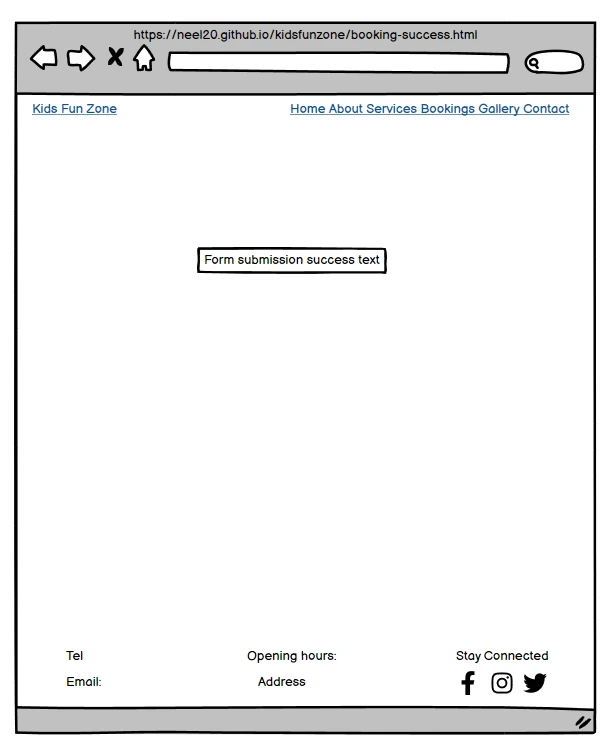
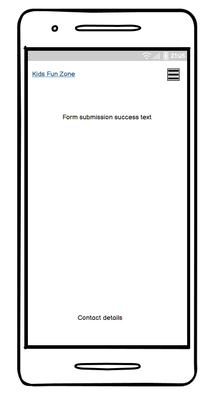
  
Gallery Page
  

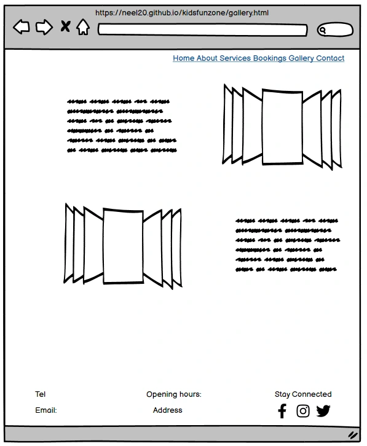
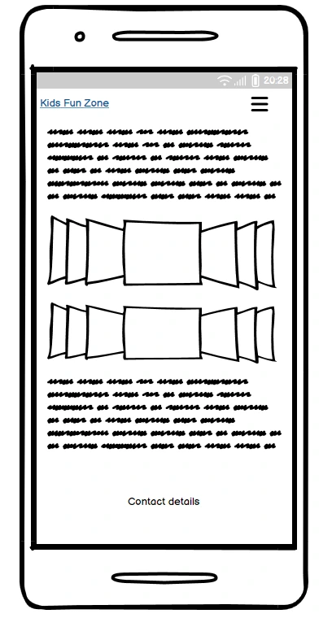

## Technologies

* HTML
  * The structure of the website was developed using HTML5 as the main language.
* Bootstrap & Custom CSS
  * The website was styled using Bootstrap and custom CSS in external file.
* Codeinstitute IDE
  * The website was developed using codeinstitute IDE, though started with VS Code and switched back to codeinstitute IDE.
* GitHub
  * Source code is hosted on GitHub and deployed using Git Pages.
* Git
  * Used to to commit and push code during the development of the website.
* Font Awesome
  * Icons obtained from https://fontawesome.com/ were used in the footer section.
* Favicon.io
  * Favicon files were craeted at https://favicon.io/favicon-converter/
* Balsamiq
  * Wireframes were craeted using balsamiq from 
* pexels.com
  * Photos and video was downloaded from https://www.pexels.com
* Tinyjpg
  * https://tinyjpg.com/ was used to reduce the size of the images used throughout the website
* freeconvert.com
  * Video was compressed from https://www.freeconvert.com/video-compressor/download
  * Used to convert the PNG file to WEBP
* https://www.canva.com/
  * Used to create the cafe image on home page
* https://daneden.github.io/animate.css
  * Used on Kids Fun Zone logo

## Testing
### Responsiveness

All pages were tested to ensure they are responsive on screen sizes starting from 320px and above as defined.

Testing Procedures:
1. Open browser and navigate to [Kids Fun Zone](https://neelp20.github.io/Kids-Fun-Zone/)
2. Open the developer tools (right click and click on inspect)
3. Set to responsive and decrease width to 320px
4. Click and drag the responsive window to maximum width

Expected:

The website is responsive across all screen sizes, with no pixelated or stretched images.

No elements overlap.

Website was tested on the various devices and no responsiveness issues were detected.

**Booking Form Testing**

The form on the booking section was tested to ensure it fuctioned as expected.
All fields in the form section require accurate input.

_Scenario One - Correct Inputs_

Steps to test:

1. Navigate to [Kids Fun Zone - Bookings page](https://neelp20.github.io/Kids-Fun-Zone/bookings.html)
2. Input the following data:
  - First name : John
  - Last name : Kina
  - Email address :johnkina@test.com
  - Select date : selected
  - Number of kids : 1
  - Number of adults : 2
  - Any message: None
  - Choose the type : Family Tickets
3. Click Submit
4. User should be redirected to booking-success.html confirmation page

Expected:

Form submits with no warnings or errors as user is redirected to booking-success.html confirmation page.

Actual:

Website behaved as expected with no errors or warnings and redirected to booking-success.html

_Scenario Two - Missing Required Field Date_

Steps to test:

1. Navigate to [Kids Fun Zone - Bookings page](https://neelp20.github.io/Kids-Fun-Zone/bookings.html)
2. Input the following data:
  - First name : John
  - Last name : Kina
  - Email address : johnkina@test.com
  - Select date : Not selected
  - Number of kids : 1
  - Number of adults : 2
  - Any message : None
  - Choose the type : Family Tickets
3. Click Submit
4. User will get the prompt "Please fill out this field"

Expected:

The form does not submit and an Error is displayed to tell the user that the field is required.

Actual:

Website behaved as expected, error message was displayed and the form did not submit.

_Scenario Three - Incorrect email format_

Steps to test:

1. Navigate to [Kids Fun Zone - Bookings page](https://neelp20.github.io/Kids-Fun-Zone/bookings.html)
2. Input the following data:
  - First name : John
  - Last name : Kina
  - Email address : john.kinatest.com
  - Select date : Not selected
  - Number of kids : 1
  - Number of adults : 2
  - Any message : None
  - Choose the type : Family Tickets
3. Click Submit
4. User will get the prompt "Please include an '@' in the email address.

Expected:

The form does not submit and an Error is displayed to tell the user that the field is required.

Actual:

Website behaved as expected, error message was displayed and the form did not submit.

